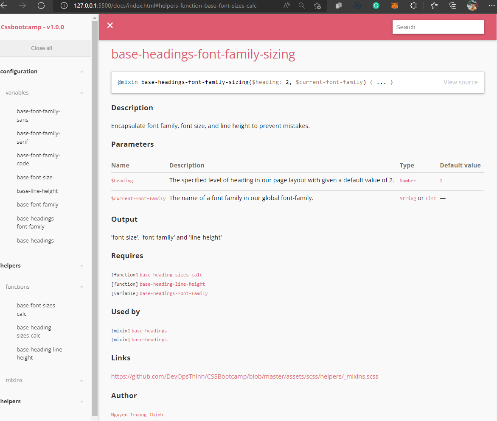
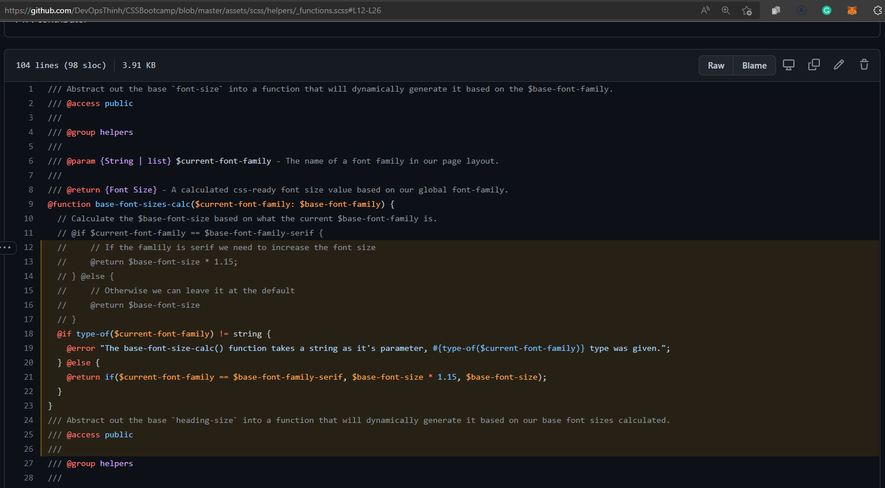

####  "Start writing some Syntactically Awesome Style Sheets (Sass). Clean, beautiful code, make other devs be able to read what is there & understand it!" 

### Commands
- "node-sass --output-style compressed scss --output css" in assets directory for compile *.scss files into css files; 
- "npm run build" or "gulp sdocs" in root of project directory for generate sass documentation.  
 
  

### Used Software Info:
- Visual Studio Code v1.67.1
- Node.js 16
- LibSass (with node-sass): a wrapped C/C++ library
- Toolkit: SassDoc 2.0 from Hugo in Gulp pipelines

### References
- Sass: https://sass-lang.com/
- SassDoc: http://sassdoc.com/